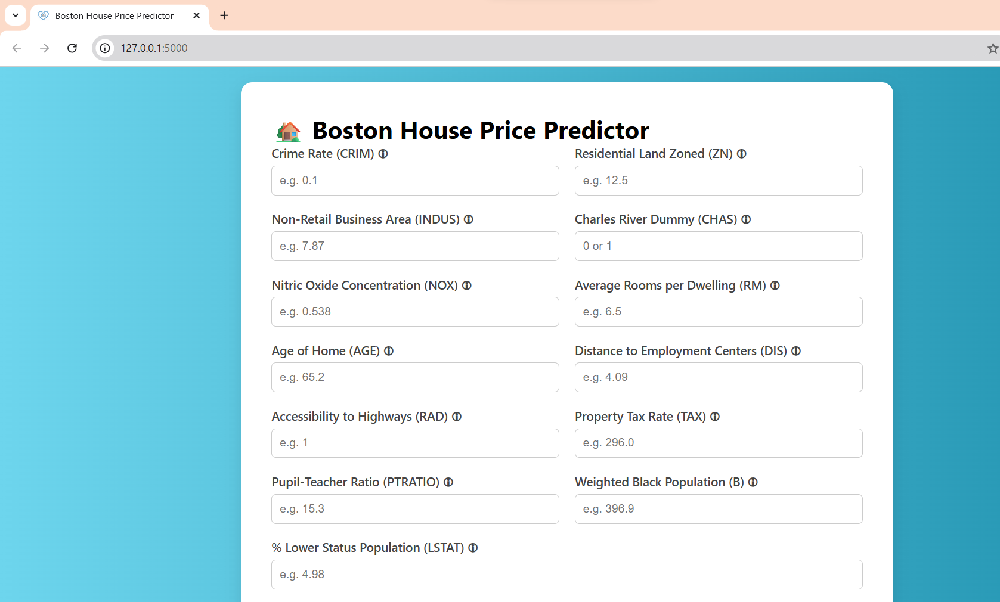

# 🏡 Boston House Price Prediction Web App

This is a simple **Machine Learning-powered web application** built using **Flask** to predict **house prices in Boston** based on various features from the Boston Housing dataset.

---

## 📊 Dataset

The dataset used is the classic **Boston Housing Dataset**, which contains information collected by the U.S Census Service concerning housing in the area of Boston, Massachusetts.

**Features used for prediction:**

| Feature | Description |
|--------|-------------|
| CRIM    | Per capita crime rate by town |
| ZN      | Proportion of residential land zoned for lots over 25,000 sq.ft. |
| INDUS   | Proportion of non-retail business acres per town |
| CHAS    | Charles River dummy variable (= 1 if tract bounds river; 0 otherwise) |
| NOX     | Nitric oxides concentration (parts per 10 million) |
| RM      | Average number of rooms per dwelling |
| AGE     | Proportion of owner-occupied units built prior to 1940 |
| DIS     | Weighted distances to five Boston employment centers |
| RAD     | Index of accessibility to radial highways |
| TAX     | Full-value property-tax rate per $10,000 |
| PTRATIO | Pupil-teacher ratio by town |
| B       | 1000(Bk - 0.63)^2 where Bk is the proportion of Black residents by town |
| LSTAT   | % Lower status of the population |

---

## 🚀 Features

- User-friendly input form with tooltips and placeholders
- Dynamic prediction of house prices
- Clean and responsive UI
- Powered by **Flask** and **scikit-learn**

---

## 🛠️ Tech Stack

- Python
- Flask
- HTML/CSS
- scikit-learn
- NumPy / Pandas

---

## 🖼️ Preview



---

## 🚀 Live Demo

🔗 [Click here to use the app](https://boston-house-price-predictor-ai1b.onrender.com)


## ⚙️ How to Run Locally

1. Clone the repository:
   ```bash
   git clone https://github.com//boston-house-price-predictor.git
   cd boston-house-price-predictor
